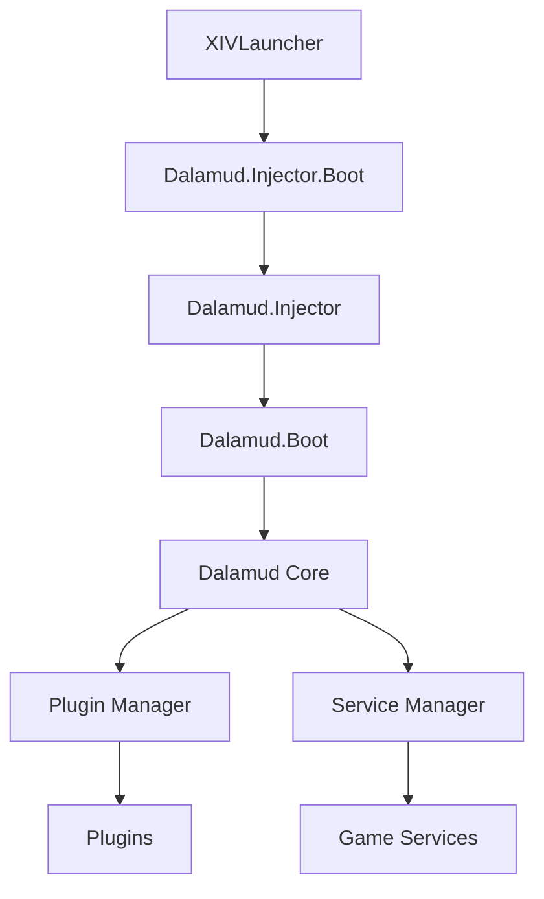

Dalamud is a sophisticated plugin framework for FFXIV that uses a multi-layered architecture to safely inject managed code into the game process. This page explains how Dalamud is structured and how it boots.

## Architecture Overview

Dalamud's architecture consists of multiple components working together to provide a stable plugin development environment:



## Components

Dalamud is composed of several distinct components, each serving a specific purpose:

<AccordionGroup>
  <Accordion title="Dalamud.Injector.Boot (C++)" icon="syringe">
    The first component in the boot chain. Written in C++, this component:
    - Loads the .NET Core runtime via `hostfxr`
    - Initializes the CoreCLR hosting environment
    - Kicks off `Dalamud.Injector` in managed code
    - Handles low-level process initialization
  </Accordion>

  <Accordion title="Dalamud.Injector (C#)" icon="code">
    A managed C# component that performs DLL injection:
    - Injects `Dalamud.Boot` into the target FFXIV process
    - Manages the injection timing and methodology
    - Handles error cases during injection
    - Coordinates with XIVLauncher for process management
  </Accordion>

  <Accordion title="Dalamud.Boot (C++)" icon="boot">
    A native DLL loaded into the game process that:
    - Loads the .NET Core runtime into the active process
    - Bootstraps the managed Dalamud core
    - Rewrites the target process entrypoint when necessary
    - Sets up exception handling and crash reporting
    - Initializes MinHook for function hooking
  </Accordion>

  <Accordion title="Dalamud Core (C#)" icon="cube">
    The main managed framework providing:
    - Core API and game bindings
    - Plugin loading and management infrastructure
    - Service container and dependency injection
    - Event system and game state tracking
    - UI framework integration (ImGui)
  </Accordion>

  <Accordion title="Dalamud.CorePlugin (C#)" icon="flask">
    A special testbed plugin that:
    - Has access to Dalamud internals
    - Used to prototype new framework features
    - Tests plugin API changes before public release
    - Validates core functionality
  </Accordion>
</AccordionGroup>

## Boot Pipeline

The Dalamud boot process follows a carefully orchestrated pipeline to ensure safe initialization:

<Steps>
  <Step title="XIVLauncher Starts">
    XIVLauncher manages the game launch and determines when to inject Dalamud based on user configuration.
  </Step>

  <Step title="Dalamud.Injector.Boot Initializes">
    The boot component loads the .NET Core runtime and starts the managed injector:
    
    ```cpp
    // Loads CoreCLR via hostfxr
    hostfxr_initialize_for_runtime_config()
    hostfxr_get_runtime_delegate()
    ```
  </Step>

  <Step title="Dalamud.Injector Performs Injection">
    The injector injects `Dalamud.Boot.dll` into the FFXIV process using platform-appropriate injection techniques.
  </Step>

  <Step title="Dalamud.Boot Loads Runtime">
    Inside the game process, `Dalamud.Boot` loads .NET Core and calls into `EntryPoint.Initialize()`:
    
    ```cpp
    // From Dalamud.Boot/dllmain.cpp
    InitializeImpl(lpParam, hMainThreadContinue)
    ```
  </Step>

  <Step title="EntryPoint Initializes">
    The managed entry point sets up logging, configuration, and creates the main Dalamud instance:
    
    ```csharp
    // From Dalamud/EntryPoint.cs:57
    public static void Initialize(IntPtr infoPtr, IntPtr mainThreadContinueEvent)
    {
        var infoStr = Marshal.PtrToStringUTF8(infoPtr)!;
        var info = JsonConvert.DeserializeObject<DalamudStartInfo>(infoStr)!;
        new Thread(() => RunThread(info, mainThreadContinueEvent)).Start();
    }
    ```
  </Step>

  <Step title="Dalamud Core Constructs">
    The main `Dalamud` class initializes core subsystems:
    
    ```csharp
    // From Dalamud/Dalamud.cs:52
    public Dalamud(DalamudStartInfo info, ReliableFileStorage fs, 
                   DalamudConfiguration configuration, IntPtr mainThreadContinueEvent)
    {
        // Initialize SigScanner for game memory scanning
        scanner = new TargetSigScanner(...);
        
        // Initialize service container and services
        ServiceManager.InitializeProvidedServices(
            this, fs, configuration, scanner, localization);
        
        // Start early-loading services
        ServiceManager.InitializeEarlyLoadableServices();
    }
    ```
  </Step>

  <Step title="Services Initialize">
    The Service Manager initializes all framework services in dependency order. See [Dependency Injection](/concepts/dependency-injection) for details.
  </Step>

  <Step title="Game Thread Resumes">
    Once blocking services are ready, Dalamud signals the game's main thread to continue:
    
    ```csharp
    // From Dalamud/Dalamud.cs:91
    void KickoffGameThread()
    {
        Log.Verbose("=============== GAME THREAD KICKOFF ===============");
        Timings.Event("Game thread kickoff");
        Windows.Win32.PInvoke.SetEvent(new HANDLE(mainThreadContinueEvent));
    }
    ```
  </Step>

  <Step title="Plugins Load">
    The Plugin Manager loads plugins based on their `LoadRequiredState` and `LoadSync` settings. See [Plugin Lifecycle](/concepts/plugin-lifecycle) for details.
  </Step>
</Steps>

## Thread Model

Dalamud operates across multiple threads to ensure safe interaction with the game:

<CardGroup cols={2}>
  <Card title="Main Game Thread" icon="gamepad">
    The game's primary rendering and logic thread. Plugins should avoid blocking this thread to prevent frame drops.
  </Card>

  <Card title="Framework Thread" icon="clock">
    Dalamud's framework update thread, synchronized with the game's update tick. Most plugin logic runs here.
  </Card>

  <Card title="Service Initialization Threads" icon="gears">
    Background threads used during startup to initialize services without blocking the game.
  </Card>

  <Card title="Plugin Loader Threads" icon="download">
    Separate threads for loading plugins asynchronously, preventing startup delays.
  </Card>
</CardGroup>

<Note>
  Always use `Framework.RunOnFrameworkThread()` or `Framework.RunOnTick()` when you need to execute code that interacts with game state from another thread.
</Note>

## Memory Architecture

Dalamud uses several techniques to safely interact with game memory:

### Signature Scanning

Dalamud locates game functions and data structures using byte pattern signatures:

```csharp
// From Dalamud/Dalamud.cs:68
scanner = new TargetSigScanner(
    true, 
    new FileInfo(Path.Combine(cacheDir.FullName, $"{this.StartInfo.GameVersion}.json"))
);
```

Signatures are cached per game version to improve startup performance.

### Function Hooking

Dalamud uses [Reloaded.Hooks](https://github.com/Reloaded-Project/Reloaded.Hooks) for type-safe function hooking:

```csharp
// Example hook pattern
this.myHook = Hook<MyDelegate>.FromAddress(address, MyDetour);
this.myHook.Enable();
```

### ClientStructs Integration

Dalamud integrates [FFXIVClientStructs](https://github.com/aers/FFXIVClientStructs) for type-safe access to game structures:

```csharp
// From Dalamud/Dalamud.cs:232
InteropGenerator.Runtime.Resolver.GetInstance.Setup(
    Service<TargetSigScanner>.Get().SearchBase, 
    $"{this.StartInfo.GameVersion}", 
    new FileInfo(Path.Combine(cacheDir.FullName, "cs.json"))
);
FFXIVClientStructs.Interop.Generated.Addresses.Register();
InteropGenerator.Runtime.Resolver.GetInstance.Resolve();
```

## Isolation and Safety

Dalamud provides several layers of isolation to ensure stability:

<Steps>
  <Step title="Assembly Load Contexts">
    Each plugin loads in its own `AssemblyLoadContext`, preventing assembly conflicts:
    
    ```csharp
    // From Dalamud/Plugin/Internal/Loader/PluginLoader.cs:34
    this.context = (ManagedLoadContext)this.contextBuilder.Build();
    ```
  </Step>

  <Step title="Exception Handling">
    Dalamud catches and logs exceptions from plugins to prevent crashes:
    
    ```csharp
    // From Dalamud/EntryPoint.cs:160
    AppDomain.CurrentDomain.UnhandledException += OnUnhandledExceptionDefault;
    ```
  </Step>

  <Step title="Service Scoping">
    Plugins receive scoped service instances that can be safely disposed:
    
    ```csharp
    // Services are injected through IoC container
    // See ServiceContainer.CreateAsync() in ServiceContainer.cs:94
    ```
  </Step>
</Steps>

<Warning>
  While Dalamud provides isolation, plugins can still cause instability through unsafe memory operations or excessive resource usage. Always test thoroughly!
</Warning>

## Version Management

Dalamud uses API levels to handle breaking changes:

```csharp
// From Dalamud/Plugin/Internal/PluginManager.cs:81
static PluginManager()
{
    DalamudApiLevel = typeof(PluginManager).Assembly.GetName().Version!.Major;
}
```

<Info>
  As of Dalamud 9.x and later, the API level always matches the major version number. Only plugins built for the current API level will load.
</Info>

## Next Steps

<CardGroup cols={2}>
  <Card title="Plugin Lifecycle" icon="rotate" href="/concepts/plugin-lifecycle">
    Learn how plugins are loaded, initialized, and unloaded
  </Card>

  <Card title="Dependency Injection" icon="plug" href="/concepts/dependency-injection">
    Understand Dalamud's IoC container and service system
  </Card>

  <Card title="Service Locator" icon="magnifying-glass" href="/concepts/service-locator">
    Learn how to access Dalamud services in your plugin
  </Card>

  <Card title="Building Dalamud" icon="hammer" href="/guides/building-dalamud">
    Compile Dalamud from source
  </Card>
</CardGroup>
