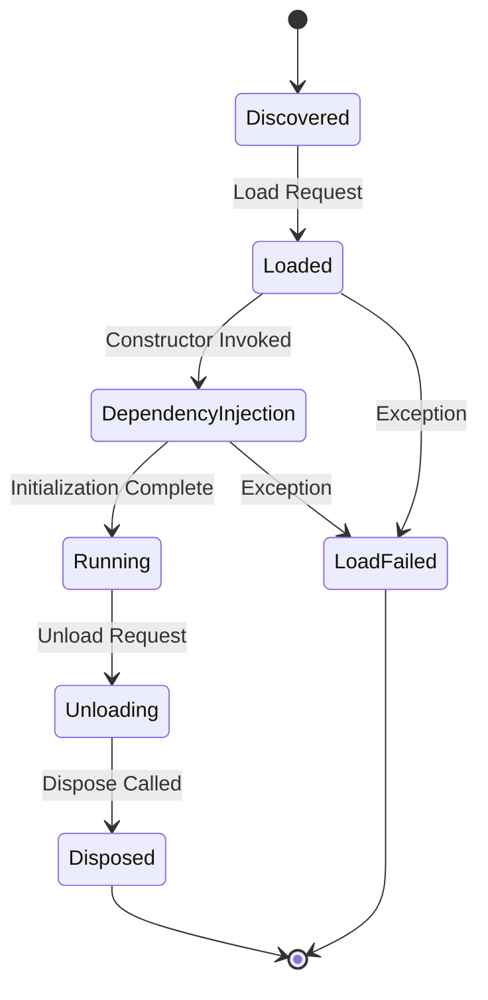

Plugins in Dalamud follow a well-defined lifecycle from discovery to unload. Understanding this lifecycle is crucial for building robust plugins that integrate cleanly with the framework.

## Lifecycle Overview



## Plugin Discovery

Dalamud discovers plugins by scanning the plugin directory for valid plugin manifests.

### Plugin Manifest

Every plugin must have a manifest file (`.json`) describing its metadata:

```json
{
  "Author": "YourName",
  "Name": "My Plugin",
  "InternalName": "MyPlugin",
  "AssemblyVersion": "1.0.0.0",
  "Description": "Does something cool",
  "ApplicableVersion": "any",
  "DalamudApiLevel": 9,
  "LoadRequiredState": 0,
  "LoadSync": false,
  "LoadPriority": 0
}
```

<Info>
  The `DalamudApiLevel` must match the current Dalamud major version. For Dalamud 9.x, this value must be `9`.
</Info>

### Load States

Plugins can specify when they should be loaded using `LoadRequiredState`:

<Tabs>
  <Tab title="DrawAvailable (0)">
    **Default behavior.** Plugin loads when drawing facilities are available.
    
    ```json
    {
      "LoadRequiredState": 0
    }
    ```
    
    <Info>Use this for plugins that need ImGui or game UI access immediately.</Info>
  </Tab>

  <Tab title="FrameworkTick (1)">
    Plugin loads during Framework.Tick, before drawing is available.
    
    ```json
    {
      "LoadRequiredState": 1
    }
    ```
    
    <Note>Use this if you need early initialization but don't need UI immediately.</Note>
  </Tab>

  <Tab title="Anytime (2)">
    Plugin can load at any time, even before the game is fully initialized.
    
    ```json
    {
      "LoadRequiredState": 2
    }
    ```
    
    <Warning>Only use this if your plugin has no game state dependencies.</Warning>
  </Tab>
</Tabs>

### Synchronous vs Asynchronous Loading

The `LoadSync` property controls whether your plugin blocks the boot process:

<CodeGroup>
```json Synchronous (LoadSync: true)
{
  "LoadSync": true
}
```

```json Asynchronous (LoadSync: false)
{
  "LoadSync": false
}
```
</CodeGroup>

<Note>
  Synchronous plugins are loaded sequentially and can delay game startup. Only use `LoadSync: true` if your plugin must be ready before others load.
</Note>

## Loading Process

When a plugin is loaded, Dalamud follows these steps:

<Steps>
  <Step title="Assembly Loading">
    Dalamud creates an isolated `AssemblyLoadContext` for the plugin:
    
    ```csharp
    // From Dalamud/Plugin/Internal/Loader/PluginLoader.cs:34
    this.context = (ManagedLoadContext)this.contextBuilder.Build();
    ```
    
    This ensures plugins don't conflict with each other or with Dalamud's dependencies.
  </Step>

  <Step title="Type Discovery">
    Dalamud scans the plugin assembly for types implementing `IDalamudPlugin`:
    
    ```csharp
    public interface IDalamudPlugin : IDisposable
    {
        // Your plugin class implements this
    }
    ```
  </Step>

  <Step title="Dependency Injection">
    The IoC container resolves all constructor and property dependencies:
    
    ```csharp
    // Example plugin constructor
    public MyPlugin(DalamudPluginInterface pluginInterface, CommandManager commands)
    {
        // Dependencies automatically injected
    }
    ```
    
    See [Dependency Injection](/concepts/dependency-injection) for details.
  </Step>

  <Step title="Constructor Execution">
    Your plugin's constructor runs in a long-running task to avoid thread pool exhaustion:
    
    ```csharp
    // From Dalamud/IoC/Internal/ServiceContainer.cs:121
    await Task.Factory.StartNew(
        () => ctor.Invoke(instance, resolvedParams),
        CancellationToken.None,
        TaskCreationOptions.LongRunning,
        TaskScheduler.Default).ConfigureAwait(false);
    ```
    
    <Warning>
      Plugin constructors can block but should complete quickly. Avoid long-running operations in your constructor.
    </Warning>
  </Step>

  <Step title="Property Injection">
    After construction, services marked with `[PluginService]` are injected:
    
    ```csharp
    public class MyPlugin : IDalamudPlugin
    {
        [PluginService] 
        public static IDataManager DataManager { get; set; } = null!;
    }
    ```
  </Step>

  <Step title="Running State">
    The plugin is now fully loaded and operational. Dalamud tracks its state as `PluginState.Loaded`.
  </Step>
</Steps>

## Plugin Startup Tracking

For synchronous plugins (`LoadSync: true`), Dalamud tracks startup progress:

```csharp
// From Dalamud/Plugin/Internal/PluginManager.cs:627
this.StartupLoadTracking = new();
foreach (var pluginDef in pluginDefs.Where(x => x.Manifest.LoadSync))
{
    this.StartupLoadTracking.Add(pluginDef.Manifest!.InternalName, pluginDef.Manifest.Name);
}
```

This allows users to see which plugins are causing startup delays.

## Running Phase

Once loaded, your plugin interacts with the game through Dalamud's services:

### Event Handling

```csharp
public MyPlugin(DalamudPluginInterface pluginInterface, IFramework framework)
{
    framework.Update += OnFrameworkUpdate;
}

private void OnFrameworkUpdate(IFramework framework)
{
    // Called every game tick (~60 FPS)
}
```

### UI Drawing

```csharp
public MyPlugin(DalamudPluginInterface pluginInterface)
{
    pluginInterface.UiBuilder.Draw += DrawUI;
}

private void DrawUI()
{
    ImGui.Begin("My Window");
    ImGui.Text("Hello, world!");
    ImGui.End();
}
```

### Command Registration

```csharp
public MyPlugin(ICommandManager commands)
{
    commands.AddHandler("/mycommand", new CommandInfo(OnCommand)
    {
        HelpMessage = "Does something cool"
    });
}

private void OnCommand(string command, string args)
{
    // Handle command
}
```

## Unloading Process

Plugins unload when the user disables them or when Dalamud shuts down:

<Steps>
  <Step title="Unload Request">
    The Plugin Manager initiates unload, changing state to `PluginState.Unloading`.
  </Step>

  <Step title="Dispose Called">
    Your plugin's `Dispose()` method is invoked:
    
    ```csharp
    public void Dispose()
    {
        // Clean up all resources
        framework.Update -= OnFrameworkUpdate;
        pluginInterface.UiBuilder.Draw -= DrawUI;
        commands.RemoveHandler("/mycommand");
    }
    ```
    
    <Warning>
      **Always unregister ALL event handlers and commands in Dispose!** Failure to do so can cause crashes.
    </Warning>
  </Step>

  <Step title="Grace Period">
    Dalamud waits for a grace period before unloading the assembly:
    
    ```csharp
    // From Dalamud/Plugin/Internal/PluginManager.cs:51
    public const int PluginWaitBeforeFreeDefault = 1000; // 1 second
    ```
    
    This ensures all pending operations complete.
  </Step>

  <Step title="Assembly Unload">
    The plugin's `AssemblyLoadContext` is unloaded:
    
    ```csharp
    // From Dalamud/Plugin/Internal/Loader/PluginLoader.cs:116
    if (this.context.IsCollectible)
        this.context.Unload();
    ```
  </Step>

  <Step title="Garbage Collection">
    The runtime collects the unloaded assembly:
    
    ```csharp
    GC.Collect();
    GC.WaitForPendingFinalizers();
    ```
  </Step>
</Steps>

## Error Handling

Dalamud handles plugin errors gracefully to prevent crashes:

### Load Failures

If your plugin throws an exception during load:

```csharp
// From Dalamud/EntryPoint.cs:298
var pm = Service<PluginManager>.GetNullable();
var plugin = pm?.FindCallingPlugin(new StackTrace(ex));
if (plugin != null)
{
    pluginInfo = $"Plugin that caused this:\n{plugin.Name}\n\nClick \"Yes\" and remove it.\n\n";
}
```

Users are notified and can remove the problematic plugin.

### Runtime Exceptions

Exceptions in event handlers are caught and logged:

```csharp
try
{
    // Your event handler
}
catch (Exception ex)
{
    Log.Error(ex, "Exception in plugin event handler");
}
```

<Note>
  Uncaught exceptions in framework events won't crash the game, but may leave your plugin in an undefined state.
</Note>

## Plugin States

Plugins can be in one of several states:

| State | Description |
|-------|-------------|
| `Unloaded` | Plugin is installed but not loaded |
| `Loading` | Plugin is currently loading |
| `Loaded` | Plugin is running normally |
| `LoadError` | Plugin failed to load |
| `Unloading` | Plugin is being unloaded |
| `DependencyResolutionFailed` | Plugin dependencies couldn't be resolved |

## Best Practices

<AccordionGroup>
  <Accordion title="Constructor" icon="plus">
    - Keep constructors fast and simple
    - Only store references to injected services
    - Don't start background work in the constructor
    - Don't access game state that might not be ready
    
    ```csharp
    // Good
    public MyPlugin(IFramework framework)
    {
        this.framework = framework;
        this.framework.Update += OnUpdate;
    }
    
    // Bad
    public MyPlugin(IFramework framework)
    {
        Thread.Sleep(5000); // Never do this!
        var player = GetLocalPlayer(); // Might not be ready yet!
    }
    ```
  </Accordion>

  <Accordion title="Dispose" icon="trash">
    - Always implement `Dispose()` properly
    - Unregister ALL event handlers
    - Remove ALL commands
    - Dispose all IDisposable resources
    - Set large data structures to null
    
    ```csharp
    public void Dispose()
    {
        framework.Update -= OnUpdate;
        pluginInterface.UiBuilder.Draw -= DrawUI;
        commands.RemoveHandler("/mycommand");
        
        myLargeDataStructure = null;
        myDisposableResource?.Dispose();
    }
    ```
  </Accordion>

  <Accordion title="Thread Safety" icon="shield">
    - Most Dalamud services are not thread-safe
    - Use `Framework.RunOnFrameworkThread()` for game state access
    - Be careful with background tasks
    
    ```csharp
    Task.Run(async () =>
    {
        var data = await FetchDataFromApi();
        
        // Switch back to framework thread for UI updates
        await framework.RunOnFrameworkThread(() =>
        {
            UpdateUIWithData(data);
        });
    });
    ```
  </Accordion>

  <Accordion title="Performance" icon="gauge">
    - Framework.Update runs every frame (~60 FPS)
    - Keep event handlers fast (&lt;16ms)
    - Cache expensive computations
    - Use throttling for expensive operations
    
    ```csharp
    private DateTime lastCheck = DateTime.MinValue;
    
    private void OnUpdate(IFramework framework)
    {
        // Only check every second instead of 60 times per second
        if (DateTime.Now - lastCheck < TimeSpan.FromSeconds(1))
            return;
            
        lastCheck = DateTime.Now;
        DoExpensiveCheck();
    }
    ```
  </Accordion>
</AccordionGroup>

## Next Steps

<CardGroup cols={2}>
  <Card title="Dependency Injection" icon="plug" href="/concepts/dependency-injection">
    Learn how to inject services into your plugin
  </Card>

  <Card title="Service Locator" icon="magnifying-glass" href="/concepts/service-locator">
    Access services using the Service&lt;T&gt; pattern
  </Card>

  <Card title="Architecture" icon="building" href="/concepts/architecture">
    Understand Dalamud's overall architecture
  </Card>

  <Card title="Plugin Template" icon="book" href="/quickstart">
    Start building your first plugin
  </Card>
</CardGroup>
